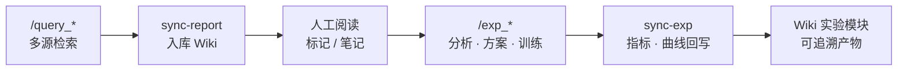

<div align="center">

# Paper_Rec

### A Research Operating System for Literature & Experiments  
### 面向科研闭环的文献检索 · 阅读 Wiki · 实验沙箱

<br/>

[](VERSION)
[](skill/VERSION)
[](skill-exp/VERSION)
[](#)

<br/>

**Discover · Annotate · Experiment · Remember**

从自然语言问题出发，完成多源文献检索与结构化报告；  
在自研 Wiki 中阅读、标注与沉淀；  
用实验沙箱做方案验证与训练闭环，并把指标与曲线写回知识库。

<br/>

`Claude Code` · `Codex` · `OpenClaw` · 及其他可加载 Markdown Skill 的 Agent 运行时

<br/>

[快速开始](#-快速开始) ·
[闭环](#-研究闭环) ·
[能力](#-核心能力) ·
[命令](#-slash-commands) ·
[架构](#-架构一览) ·
[文档](#-文档地图)

</div>

---

## 研究闭环

把「找论文 → 读论文 → 做实验 → 记结果」收成一条可复现管线：



| Stage | What happens |
|:------|:-------------|
| **Retrieve** | Query 改写 → 多源召回 → 打分排序 → 结构化报告 |
| **Curate** | 每篇独立 `README.md` · 评分/状态 · 知识图谱 |
| **Experiment** | Badcase 聚类 → 多方案 Predict-then-Verify → 小规模验证 → 训练/评估 |
| **Persist** | Loss / 指标曲线与 `paper_refs` 同步至 Wiki「实验」 |

---

## 核心能力

<table>
<tr>
<td width="33%" valign="top">

### Literature Skill
**paper-rec**

- `/query_english` · `/query_chinese` · `/query_other`
- 摘要 · 关键词 · Query 改写
- arXiv · HF · GitHub · PwC · CCF…
- Top-50 结构化字段报告

[skill/README.md](skill/README.md)

</td>
<td width="33%" valign="top">

### Experiment Skill
**exp-sandbox**

- `/exp_analysis` · `/exp_training` · `/exp_eval` · `/exp_loop`
- Predict-then-Verify 多方案筛选
- 训练监控 · 指标对照 `target_score`
- 参考伪代码 [`skill-exp/reference/`](skill-exp/reference/)

[skill-exp/README.md](skill-exp/README.md)

</td>
<td width="33%" valign="top">

### Reading Lab
**Self-hosted Wiki**

- FastAPI + Vue3 · Git Markdown
- 论文库 · 图谱 · 一周推荐
- **实验**模块：曲线 / 指标 / 关联论文
- 删除黑名单，同步可跳过

[docs/ARCHITECTURE.md](docs/ARCHITECTURE.md)

</td>
</tr>
</table>

---

## Slash Commands

### paper-rec

| Command | Role |
|:--------|:-----|
| `/query_english` | 全英文报告 |
| `/query_chinese` | 全中文报告 |
| `/query_other` | 随输入语言自适应 |
| `/wiki` · `/wiki week` · `/wiki start` | 库内列表 / 本周 / 启动 UI |

### exp-sandbox

| Command | Role |
|:--------|:-----|
| `/exp_analysis` [`train`\|`eval`] | 训练/测试集与 badcase 分析 |
| `/exp_training` | 启动训练并监控 loss / 验证曲线 |
| `/exp_eval` | 输出指标并对照 `target_score` |
| `/exp_loop` | 分析 → 方案 → 清洗验证 → 训练 → 评估 → 迭代 |

---

## 快速开始

### ① 安装 Skills（跨平台）

将指令包挂到所用 Agent 的 skills / prompts 目录：

```bash
mkdir -p .agents/skills/paper-rec .agents/skills/exp-sandbox
cp -r skill/* .agents/skills/paper-rec/
cp -r skill-exp/* .agents/skills/exp-sandbox/
```

```text
/query_chinese 多模态大模型对齐的最新进展
/exp_loop
target_score: OCR F1 >= 0.92 on test_handwriting_v2
```

### ② 启动 Wiki

```powershell
powershell -ExecutionPolicy Bypass -File apps/start-wiki.ps1
```

| Service | Endpoint |
|:--------|:---------|
| Web | http://127.0.0.1:5173/ · [实验](http://127.0.0.1:5173/experiments) |
| API | http://127.0.0.1:8787/api/health · `/api/exp` |

### ③ 报告入库 / 实验回写

```bash
cd packages/wiki-bridge && pip install -e .

# 文献报告 → 论文库
python -m wiki_bridge.cli sync-report \
  --wiki-root ../.. \
  --report ./examples/sample_report.json \
  --mode query_chinese --mark-reading

# 实验结果 → content/exp + Wiki「实验」
python -m wiki_bridge.cli sync-exp \
  --wiki-root ../.. \
  --report ./examples/sample_exp_report.json
```

### ④ 回归自检

```bash
python scripts/regress_exp_wiki.py
```

---

## 架构一览

```text
Paper_Rec_Skill/
├── skill/                      # paper-rec · 文献检索 Skill
├── skill-exp/                  # exp-sandbox · 实验沙箱 + reference/
├── apps/
│   ├── wiki-api/               # FastAPI  :8787
│   ├── wiki-web/               # Vue3 SPA :5173
│   └── start-wiki.ps1
├── packages/wiki-bridge/       # sync-report · sync-exp
├── content/
│   ├── wiki/pages/             # <kw>/<year>/<slug>/README.md
│   ├── wiki/pages/_exp/        # 实验 Wiki 镜像（不进论文索引）
│   ├── wiki/deleted.json
│   ├── exp/                    # 实验产物 · metrics · curves
│   ├── weekly/
│   └── uploads/
├── docs/
├── scripts/regress_exp_wiki.py
├── VERSION
└── CHANGELOG.md
```

| Layer | Owns |
|:------|:-----|
| **skill/** | 检索流水线与 `/wiki` 运维指令 |
| **skill-exp/** | 实验闭环与 Predict-then-Verify 参考实现 |
| **wiki-api / wiki-web** | 阅读、图谱、一周推荐、实验浏览 |
| **wiki-bridge** | 结构化报告 ↔ Git Markdown |
| **content/** | 唯一内容真源（可版本管理、可同步） |

---

## 设计原则

| Principle | Meaning |
|:----------|:--------|
| **Agent-native** | 以 Markdown Skill 驱动，不绑定单一 IDE |
| **Git as database** | 笔记与实验记录即文件，可 diff、可备份 |
| **Predict before burn** | 先多方案偏好排序与小规模验证，再全量训练 |
| **Human in the loop** | 检索与沙箱自动化；阅读标记与目标定义留给研究者 |

实验沙箱在方案排序思路上借鉴 [zjunlp/predict-before-execute](https://github.com/zjunlp/predict-before-execute)（Predict-then-Verify）；详见 [skill-exp/README.md](skill-exp/README.md#acknowledgement--借鉴说明)。

---

## 文档地图

| Doc | Audience |
|:----|:---------|
| [skill/README.md](skill/README.md) | 文献 Skill 中英入口 |
| [skill-exp/README.md](skill-exp/README.md) | 实验 Skill · 借鉴说明 |
| [skill-exp/reference/](skill-exp/reference/) | Agent 可执行的参考伪代码 |
| [docs/ARCHITECTURE.md](docs/ARCHITECTURE.md) | 模块边界与数据约定 |
| [docs/MIGRATION.md](docs/MIGRATION.md) | 路径迁移 |
| [CHANGELOG.md](CHANGELOG.md) | Workspace 版本历史 |

---

<div align="center">

### Paper_Rec

*Retrieve with any agent. Read in your own wiki. Iterate until the metric moves.*

<br/>

<sub>MIT License · Built for researchers who close the loop.</sub>

</div>
