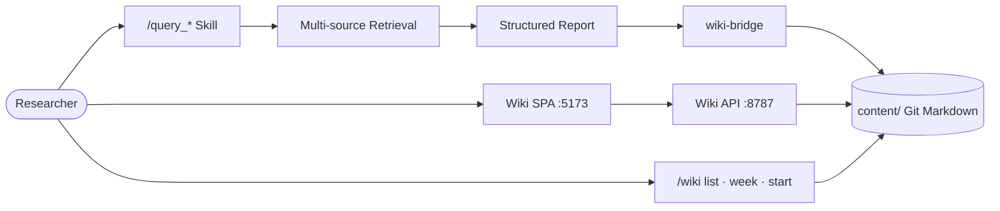

<div align="center">

# Paper_Rec

### Intelligent Literature Retrieval · Self-Hosted Reading Lab  
### 智能文献检索 · 自研阅读工作区

<br/>

[](VERSION)
[](skill/VERSION)
[](skill/SKILL.md)
[](docs/ARCHITECTURE.md)

<br/>

**从自然语言问题 → 多源检索排序 → 结构化报告 → 本地 Wiki 沉淀**

*Query rewrite · Multi-source ranking · Per-paper notes · Knowledge graph*

Compatible with **Claude Code**, **Codex**, **OpenClaw**, and other agent runtimes that load Markdown skills / prompts.

<br/>

[快速开始](#-quick-start--快速开始) ·
[Skill 文档](skill/README.md) ·
[中文 Skill](skill/README.zh-CN.md) ·
[架构](docs/ARCHITECTURE.md) ·
[变更日志](CHANGELOG.md)

</div>

---

## Why Paper_Rec

| | |
|:---|:---|
| **Agent-native** | 以 Markdown Skill / 指令包运行，无需自建检索服务；`/query_*` 切换语言模式 |
| **Cross-platform** | 不绑定单一 IDE：Claude Code · Codex · OpenClaw · 其他 Agent 工作台均可挂载 `skill/` |
| **Research-grade** | 多源召回 + 相似性 / 相关性 / 重要性 / 时效性打分，Top-50 结构化输出 |
| **Your reading lab** | 自研 Wiki：每篇独立 `README.md`、一周推荐、实体知识图谱 |
| **Git as database** | 论文笔记即 Markdown，可版本管理、可同步、可离线 |

---

## Architecture



| Layer | Path | Responsibility |
|:------|:-----|:---------------|
| **Skill** | [`skill/`](skill/) | `/query_english` · `/query_chinese` · `/query_other` · `/wiki` |
| **API** | [`apps/wiki-api/`](apps/wiki-api/) | Pages · search · graph · weekly · delete blacklist · upload |
| **Web** | [`apps/wiki-web/`](apps/wiki-web/) | Vue3 阅读 / 编辑 / 图谱 / 一周推荐 |
| **Bridge** | [`packages/wiki-bridge/`](packages/wiki-bridge/) | 报告 → 每篇 `…/slug/README.md` + 关键词日志 |
| **Content** | [`content/`](content/) | Git Markdown 真源；`deleted.json` 黑名单 |

详情：[docs/ARCHITECTURE.md](docs/ARCHITECTURE.md)

---

## Capabilities

<table>
<tr>
<td width="50%">

### Skill · 检索

- 输入摘要 / 关键词 / Query 改写  
- arXiv · HF Papers · GitHub · PwC · CCF…  
- Pack 路由（含 A-CN 国产 LLM）  
- 字段级结构化报告（≤2 句/字段）  

</td>
<td width="50%">

### Wiki · 沉淀

- **N 篇结果 → N 份可编辑 README**  
- 摘要 · 检索分 · 入库时间 · 个人评分  
- 一周推荐（去重追加）  
- 知识图谱：关键词 / 团队 / 公司同色连线  
- 删除进黑名单，同步不再入库  

</td>
</tr>
</table>

---

## Slash Commands

| Command | Mode | What you get |
|:--------|:-----|:-------------|
| `/query_english` | EN | Full English report |
| `/query_chinese` | 中文 | 全中文报告 |
| `/query_other` | Adaptive | 跟随输入语言 |
| `/wiki` | Ops | 列出库内论文 |
| `/wiki week` | Ops | 本周入库（去重） |
| `/wiki start` | Ops | 一键启动 Wiki UI |

> 同步后：`/query_*` 会记入 `content/wiki/pages/<keyword>/README.md`；每篇论文在  
> `content/wiki/pages/<keyword>/<year>/<slug>/README.md`。

---

## Quick Start · 快速开始

### ① Install Skill（多平台）

将 [`skill/`](skill/) 挂到你所用 Agent 的 **skills / prompts / 指令目录**（名称因平台而异）：

```bash
# 通用：复制到项目内的 skills 目录（示例路径，按平台调整）
mkdir -p .agents/skills/paper-rec   # 或 skills/paper-rec、.claude/skills/ 等
cp -r skill/* .agents/skills/paper-rec/
```

| Runtime | 典型做法 |
|:--------|:---------|
| **Claude Code** | 将 `skill/` 放入项目 skills / 自定义指令可读路径 |
| **Codex** | 作为 agent skill / prompt pack 加载 `SKILL.md` |
| **OpenClaw** | 按平台 skills 约定挂载本目录 |
| **其他** | 只要 Agent 能读取 `skill/SKILL.md` 即可 |

安装后在对话中直接：

```text
/query_chinese 最新 DeepSeek 与 Qwen 技术报告对比
```

### ② Launch Wiki

```powershell
powershell -ExecutionPolicy Bypass -File apps/start-wiki.ps1
```

| Service | URL |
|:--------|:----|
| Web | http://127.0.0.1:5173/ |
| API | http://127.0.0.1:8787/api/health |

### ③ Persist Report → Library

```bash
cd packages/wiki-bridge && pip install -e .
python -m wiki_bridge.cli sync-report \
  --wiki-root ../.. \
  --report ./examples/sample_report.json \
  --query-id demo \
  --mode query_chinese \
  --mark-reading
```

---

## Repository Layout

```text
Paper_Rec_Skill/
├── skill/                      # Agent Skill（检索核心，跨平台）
├── apps/
│   ├── wiki-api/               # FastAPI
│   ├── wiki-web/               # Vue3 SPA
│   └── start-wiki.ps1          # 一键启动
├── packages/wiki-bridge/       # sync-report / rebuild-index
├── content/
│   ├── wiki/pages/             # <kw>/<year>/<slug>/README.md
│   ├── wiki/deleted.json       # 删除黑名单
│   ├── weekly/                 # 周刊（可选）
│   └── uploads/
├── docs/                       # 架构 · 迁移
├── VERSION                     # Workspace SemVer
└── CHANGELOG.md
```

---

## Documentation Map

| Doc | Audience |
|:----|:---------|
| [skill/README.md](skill/README.md) | Skill hub（中英入口） |
| [skill/README.zh-CN.md](skill/README.zh-CN.md) | 中文使用说明 |
| [skill/README.en.md](skill/README.en.md) | English guide |
| [skill/SKILL.md](skill/SKILL.md) | Agent 执行规范 |
| [docs/ARCHITECTURE.md](docs/ARCHITECTURE.md) | 模块边界与数据约定 |
| [docs/MIGRATION.md](docs/MIGRATION.md) | 路径迁移说明 |
| [CHANGELOG.md](CHANGELOG.md) | Workspace 版本历史 |

---

<div align="center">

**Paper_Rec** — retrieve with any agent, remember in your own wiki.

*Built for researchers · works across agent platforms.*

</div>
