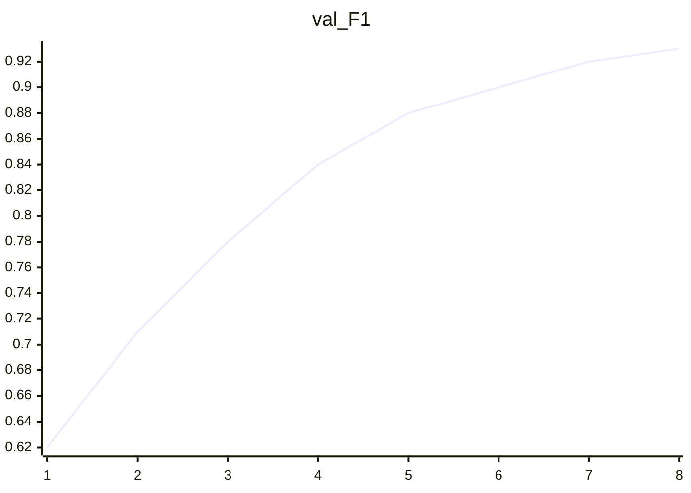

# Final Experiment Report — demo-ocr-handwriting-v1

## Outcome
- target_score met? yes
- best metrics / run: `{"F1": 0.93, "CER": 0.07, "precision": 0.94, "recall": 0.92}`

## Curves
### train_loss

- sparkline: `█▅▃▂▂▁▁▁`

- points: [(1, 1.82), (2, 1.41), (3, 1.12), (4, 0.95), (5, 0.81), (6, 0.72), (7, 0.66), (8, 0.61)]

```mermaid
xychart-beta
  title "train_loss"
  x-axis [1, 2, 3, 4, 5, 6, 7, 8]
  line [1.82, 1.41, 1.12, 0.95, 0.81, 0.72, 0.66, 0.61]
```

### val_F1

- sparkline: `▁▃▄▅▆▇▇█`

- points: [(1, 0.62), (2, 0.71), (3, 0.78), (4, 0.84), (5, 0.88), (6, 0.9), (7, 0.92), (8, 0.93)]



## Metrics
| Metric | Value |
|---|---|
| F1 | 0.93 |
| CER | 0.07 |
| precision | 0.94 |
| recall | 0.92 |

## Future optimizations
1. 扩充繁体手写子集
2. 加入测试时增强 (TTA) 做二次确认

## Artifacts
- content/exp/demo-ocr-handwriting-v1/
- wiki: `_exp/demo-ocr-handwriting-v1`
