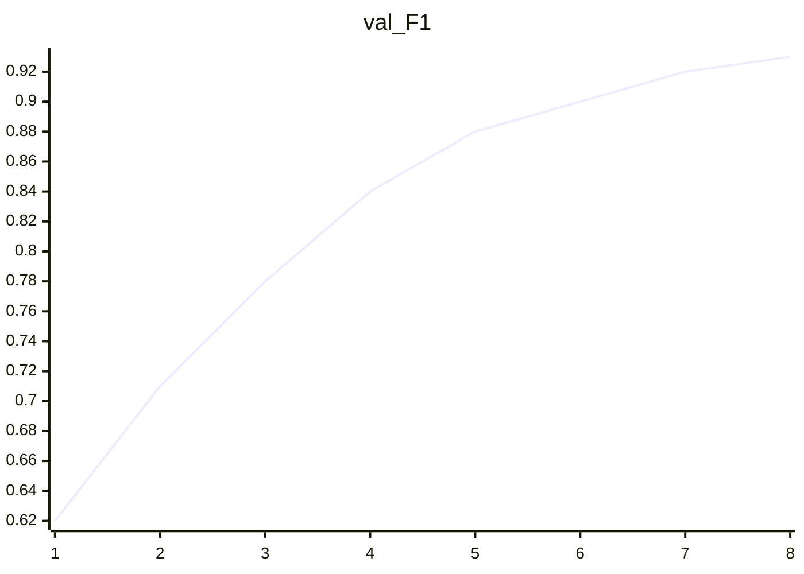

# 实验 · Handwriting OCR — Predict-then-Verify demo

> 由 `/exp_*` 沙箱同步。原始产物：`content/exp/demo-ocr-handwriting-v1/`

## 关联论文（人工阅读标记后可挂接）
- [[llm/2025/getting-started]]

## 目标与结果
| 字段 | 值 |
|---|---|
| task | handwriting_ocr |
| eval_set | test_handwriting_v2 |
| metric | F1 |
| threshold | 0.92 |
| target_met | ✅ |


## 训练曲线（loss / metrics）
### train_loss

- sparkline: `█▅▃▂▂▁▁▁`

- points: [(1, 1.82), (2, 1.41), (3, 1.12), (4, 0.95), (5, 0.81), (6, 0.72), (7, 0.66), (8, 0.61)]

```mermaid
xychart-beta
  title "train_loss"
  x-axis [1, 2, 3, 4, 5, 6, 7, 8]
  line [1.82, 1.41, 1.12, 0.95, 0.81, 0.72, 0.66, 0.61]
```

### val_F1

- sparkline: `▁▃▄▅▆▇▇█`

- points: [(1, 0.62), (2, 0.71), (3, 0.78), (4, 0.84), (5, 0.88), (6, 0.9), (7, 0.92), (8, 0.93)]



## 指标表
| Metric | Value |
|---|---|
| F1 | 0.93 |
| CER | 0.07 |
| precision | 0.94 |
| recall | 0.92 |

## 分析摘要
坏例聚类显示手写拼音与低分辨率扫描为主要失败模式；Top-1 方案（增广+难例重标）小规模验证后全量训练达标。

## 后续优化
- 扩充繁体手写子集
- 加入测试时增强 (TTA) 做二次确认
