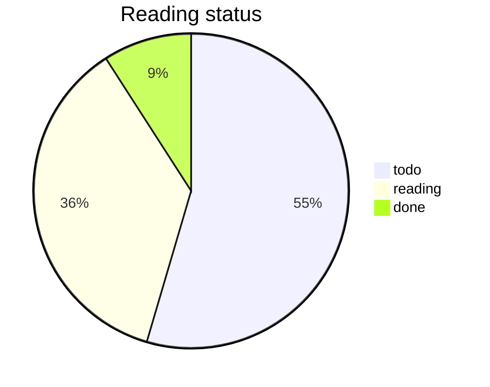

# Reading Dashboard

Generated by **wiki-bridge**. Regenerate with `rebuild-index`.

## Summary

| Metric | Value |
|--------|------:|
| Total papers | 11 |
| todo | 6 |
| reading | 4 |
| done | 1 |
| abandoned | 0 |

<!-- BRIDGE:DASHBOARD_SUMMARY -->

## By status

<!-- BRIDGE:DASHBOARD_STATUS_PIE -->

## By year

| Year | Count |
|------|------:|
| unkn | 6 |
| 2026 | 2 |
| 2025 | 3 |

<!-- BRIDGE:DASHBOARD_YEAR_TABLE -->

## Recent updates

| Date | Title | Status |
|------|-------|--------|
| — | README | todo |
| — | README | todo |
| 2026-07-17 | Skill Pipeline Probe Paper for Weekly Dedupe | reading |
| 2026-07-17 | Joint Test Unique Paper Alpha | reading |
| 2026-07-17 | Qwen3 Technical Report | reading |
| — | Getting Started | done |
| 2026-07-17 | 'DeepSeek-R1: Incentivizing Reasoning Capability in LLMs via Reinforcement | reading |
| — | skill-test-weekly | todo |
| — | readme-cmd-demo | todo |
| — | joint-test-2026-07-17 | todo |

<!-- BRIDGE:DASHBOARD_RECENT -->
