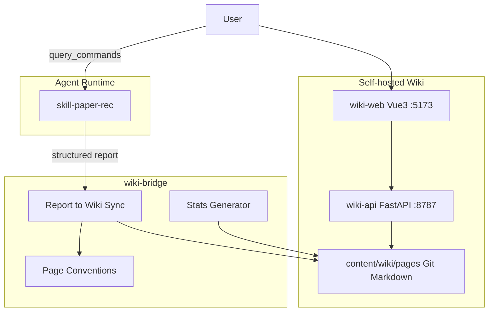

# Architecture / 架构

## Modules

| Module | Path | Owns | Does not own |
|--------|------|------|--------------|
| **skill-paper-rec** | `skill/` | Query rewrite, retrieval, scoring, `/wiki` | Long-term notes UI |
| **wiki-api** | `apps/wiki-api/` | Markdown CRUD, search, graph, weekly, upload | Retrieval algorithms |
| **wiki-web** | `apps/wiki-web/` | Vue SPA | Persistence format |
| **wiki-bridge** | `packages/wiki-bridge/` | Page naming, report write, index/dashboard | Replacing Skill |
| **content** | `content/` | Git Markdown store | UI |

Skill runs on any agent that can load `skill/SKILL.md` (Claude Code, Codex, OpenClaw, etc.).

## Data conventions

| Path | Purpose |
|------|---------|
| `content/wiki/pages/<keyword>/<year>/<slug>/README.md` | One editable file per paper |
| `content/wiki/pages/<keyword>/README.md` | `/query_*` log for that keyword |
| `content/wiki/deleted.json` | Delete blacklist (sync skips these) |
| `content/wiki/pages/_meta/Reading_Index.md` | Auto index |
| `content/wiki/pages/_meta/Dashboard.md` | Auto stats |
| `content/weekly/` | Weekly digests (optional) |
| `content/uploads/` | Images / attachments |

## Runtime

1. **Retrieve**: Agent → `skill/SKILL.md` → Input → Retrieval → Output.
2. **Persist** (optional): `wiki_bridge` CLI → `content/wiki/pages/`.
3. **View**: `apps/start-wiki.ps1` or API `:8787` + Web `:5173`.
