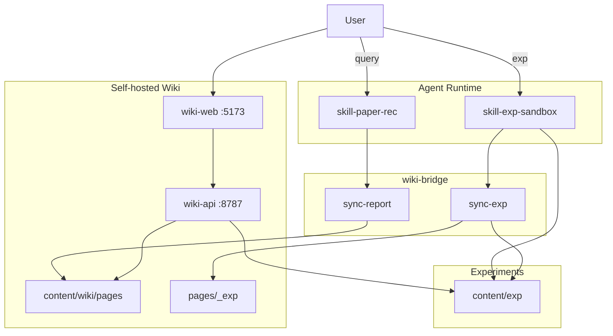

# Architecture / 架构

## Modules

| Module | Path | Owns | Does not own |
|--------|------|------|--------------|
| **skill-paper-rec** | `skill/` | Query rewrite, retrieval, scoring, `/wiki` | Training execution |
| **skill-exp-sandbox** | `skill-exp/` | `/exp_*` + `reference/` + sync-exp → Wiki 实验 | Replacing Wiki UI |
| **wiki-api** | `apps/wiki-api/` | Papers + `/api/exp` + weekly + graph | Retrieval / training |
| **wiki-web** | `apps/wiki-web/` | Vue SPA | Persistence format |
| **wiki-bridge** | `packages/wiki-bridge/` | sync-report · **sync-exp** · index/dashboard | Running train jobs |
| **content** | `content/` | Git Markdown store (wiki + exp) | UI |

Skills run on any agent that can load the corresponding `SKILL.md` (Claude Code, Codex, OpenClaw, etc.).

## Data conventions

| Path | Purpose |
|------|---------|
| `content/wiki/pages/<keyword>/<year>/<slug>/README.md` | One editable file per paper |
| `content/wiki/pages/<keyword>/README.md` | `/query_*` log for that keyword |
| `content/wiki/deleted.json` | Delete blacklist (sync skips these) |
| `content/exp/<experiment_id>/` | Exp plans, rounds, metrics, curves, final report |
| `content/wiki/pages/_exp/<id>/README.md` | Wiki 实验模块镜像（不进入论文索引） |
| `content/wiki/pages/_meta/Reading_Index.md` | Auto index |
| `content/wiki/pages/_meta/Dashboard.md` | Auto stats |
| `content/weekly/` | Weekly digests (optional) |
| `content/uploads/` | Images / attachments |

## Runtime

1. **Retrieve**: Agent → `skill/SKILL.md` → Input → Retrieval → Output.
2. **Experiment**: Agent → `skill-exp/SKILL.md` → analysis / train / eval / loop → `content/exp/`.
3. **Persist papers** (optional): `wiki_bridge` CLI → `content/wiki/pages/`.
4. **View**: `apps/start-wiki.ps1` or API `:8787` + Web `:5173`.
