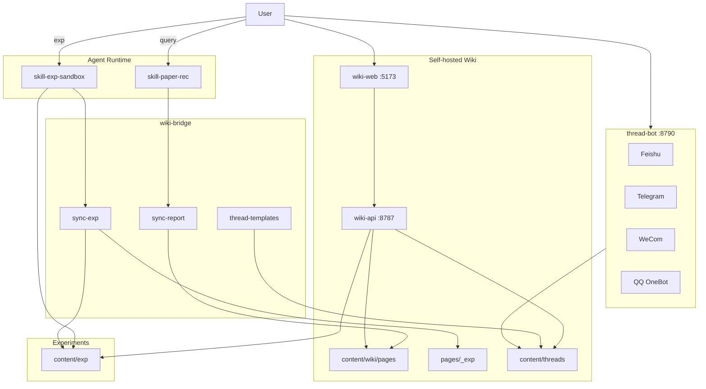

# Architecture / 架构

## Modules

| Module | Path | Owns | Does not own |
|--------|------|------|--------------|
| **skill-paper-rec** | `skill/` | Query rewrite, retrieval, scoring, `/wiki` | Training execution |
| **skill-exp-sandbox** | `skill-exp/` | `/exp_*` + `reference/` + sync-exp → Wiki 实验 | Replacing Wiki UI |
| **wiki-api** | `apps/wiki-api/` | Papers + `/api/exp` + weekly + graph + **templates** | Retrieval / training |
| **wiki-web** | `apps/wiki-web/` | Vue SPA（含主线模板市场） | Persistence format |
| **wiki-bridge** | `packages/wiki-bridge/` | sync-report · **sync-exp** · **thread-*** · **templates** · index | Running train jobs |
| **thread-mcp** | `packages/thread-mcp/` | Thread Memory MCP tools | Chat adapters |
| **thread-bot** | `packages/thread-bot/` | 飞书 / Telegram / 企微 / QQ 对话网关 | Native personal WeChat |
| **content** | `content/` | Git Markdown store (wiki + exp + **threads** + **thread-templates**) | UI |

Skills run on any agent that can load the corresponding `SKILL.md` (Claude Code, Codex, OpenClaw, etc.).

**Cognitive Thread**: see [THREAD_DESIGN.md](THREAD_DESIGN.md) — hypothesis / claims / gaps + ledger; Watch/Delta; MCP in [MCP.md](MCP.md); chat bots in [BOTS.md](BOTS.md). Not a manuscript pipeline.

## Data conventions

| Path | Purpose |
|------|---------|
| `content/wiki/pages/<keyword>/<year>/<slug>/README.md` | One editable file per paper |
| `content/wiki/pages/<keyword>/README.md` | `/query_*` log for that keyword |
| `content/wiki/deleted.json` | Delete blacklist (sync skips these) |
| `content/exp/<experiment_id>/` | Exp plans, rounds, metrics, curves, final report |
| `content/wiki/pages/_exp/<id>/README.md` | Wiki 实验模块镜像（不进入论文索引） |
| `content/threads/<thread_id>/` | Cognitive Thread v2（`thread.json` + `events.jsonl`） |
| `content/thread-templates/<id>/` | 主线模板市场（`template.json` + `thread.json`） |
| `content/wiki/pages/_meta/Reading_Index.md` | Auto index |
| `content/wiki/pages/_meta/Dashboard.md` | Auto stats |
| `content/weekly/` | Weekly digests (optional) |
| `content/uploads/` | Images / attachments |
| `content/_bot_sessions/` | Bot 会话状态（本地，默认 gitignore） |

## Runtime

1. **Retrieve**: Agent → `skill/SKILL.md` → Input → Retrieval → Output.
2. **Experiment**: Agent → `skill-exp/SKILL.md` → analysis / train / eval / loop → `content/exp/`.
3. **Persist papers** (optional): `wiki_bridge` CLI → `content/wiki/pages/`.
4. **View**: `apps/start-wiki.ps1` or API `:8787` + Web `:5173`.
5. **Chat** (optional): `python -m thread_bot serve` → `:8790` ([BOTS.md](BOTS.md)).
6. **Push** (optional): Delta webhook ([WEBHOOK.md](WEBHOOK.md)) — one-way notify, not a command loop.
