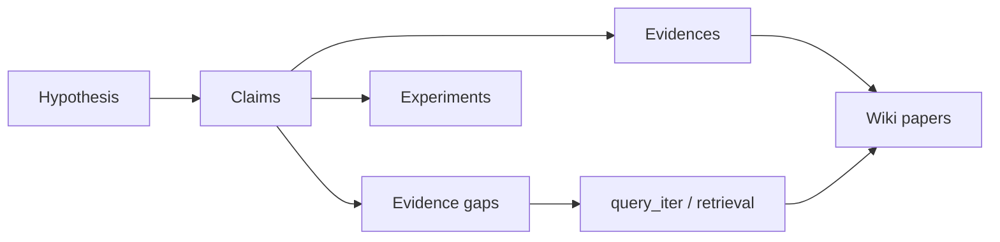

# Tutorial: Research memory with a Cognitive Thread

Goal: use one **Thread** to hold a hypothesis, claims, evidence quotes, and retrieval traces — without turning Paper_Rec into a paper-writing tool.

Sample data in-repo: `content/threads/mm-llm-alignment/`.

## 0. Setup

```bash
cd Paper_Rec_Skill
pip install -e packages/wiki-bridge
```

Optional Wiki UI: see [CONTRIBUTING.md](../CONTRIBUTING.md).

## 1. Inspect the sample thread

```bash
python -m wiki_bridge.cli thread-show --wiki-root . --id mm-llm-alignment
```

You should see:

| Field | Example |
|-------|---------|
| Hypothesis | Unified objective for multimodal preference alignment |
| Claim `C1` | preference data quality dominates algorithm choice… |
| Gap | empirical ablation on preference data quality |
| Papers | e.g. `llm/2025/getting-started` |

Ledger: `content/threads/mm-llm-alignment/events.jsonl`  
Evidence map: `content/threads/mm-llm-alignment/evidences.jsonl`

## 2. Create your own thread (optional)

```bash
python -m wiki_bridge.cli thread-create \
  --wiki-root . \
  --title "My research direction" \
  --hypothesis "…" \
  --keywords "a,b,c"
```

Edit `content/threads/<id>/thread.json` to add `claims`, `evidence_gaps`, `seed_queries`.

## 3. Retrieve with thread context

In an agent that loads `skill/`:

```text
thread:mm-llm-alignment
multimodal preference data quality vs algorithm ablations
```

Or enable iterative refine:

```text
thread:mm-llm-alignment iterative
…
```

Skill Modules **1.5 → 2a/2b → 2.5** inject seeds/gaps, multi-path search, optional one refine wave, then Thread relevance **R**.

Report sections: **Retrieval Trace** + **Thread relevance** (`skill/output-template.md`).

## 4. Persist papers + optional retrieval trace

```bash
python -m wiki_bridge.cli sync-report \
  --wiki-root . \
  --report path/to/report.json \
  --thread mm-llm-alignment \
  --query-id demo-2026-07
```

If `report.json` contains `retrieval_trace: [...]`, each round is appended as `kind: query_iter`.

Manual trace:

```bash
python -m wiki_bridge.cli query-trace \
  --wiki-root . \
  --thread mm-llm-alignment \
  --round 0 \
  --path-id gap \
  --query "preference data quality multimodal ablation" \
  --raw-hits 30 \
  --kept 12
```

## 5. Bind Claim–Evidence (quote → claim)

**CLI**

```bash
python -m wiki_bridge.cli thread-evidence-add \
  --wiki-root . \
  --thread mm-llm-alignment \
  --claim-id C1 \
  --path llm/2025/getting-started \
  --quote "…" \
  --stance supports \
  --suggested
```

Accept when you agree:

```bash
python -m wiki_bridge.cli thread-evidence-gate \
  --wiki-root . \
  --thread mm-llm-alignment \
  --evidence-id E1 \
  --gate accepted
```

**Wiki UI:** open a paper page → select a paragraph →「挂到主线」→ pick thread + claim. Thread detail shows the evidence panel.

## 6. Watch / Delta (optional)

```bash
python -m wiki_bridge.cli thread-delta \
  --wiki-root . \
  --id mm-llm-alignment \
  --mode gap_focus \
  --print-md
```

Briefs land under `content/threads/mm-llm-alignment/deltas/`.

## 7. Link an experiment (when you have one)

```bash
python -m wiki_bridge.cli thread-link-exp \
  --wiki-root . \
  --id mm-llm-alignment \
  --exp-id demo-ocr-handwriting-v1
```

Multi-run curves: put `metrics/curves.json` + `metrics/curves_<run>.json`, open Exp detail in Wiki (run overlay / `?compare=` / poll).

## Mental model



**Out of scope here:** LaTeX manuscripts, citation audit, PDF finalization (use tools like Anaxa for that). Paper_Rec owns the **cognitive ledger** until the metric moves.

## Next reading

- [THREAD_DESIGN.md](../THREAD_DESIGN.md)
- [MCP.md](../MCP.md)
- [GOOD_FIRST_ISSUES.md](../GOOD_FIRST_ISSUES.md)
- [CONTRIBUTING.md](../CONTRIBUTING.md)
