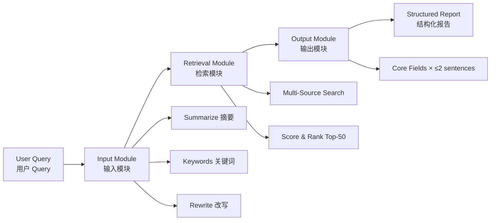

<div align="center">

# Paper_Rec

**Intelligent Literature Retrieval · Cursor Agent Skill**  
**智能文献检索 · Cursor Agent 技能**

[](VERSION)
[](https://cursor.com/docs/context/skills)
[](https://semver.org/)
[](#license)

*Query rewriting · Multi-source retrieval · Structured synthesis*

[English Docs](README.en.md) · [中文文档](README.zh-CN.md) · [Changelog](CHANGELOG.md)

</div>

---

## Overview / 概览

**Paper_Rec** is a production-ready Cursor Agent Skill that transforms natural-language research questions into ranked, structured literature reports — without writing a single line of application code.

**Paper_Rec** 是一套面向 Cursor Agent 的文献检索技能，将自然语言研究问题转化为排序后的结构化论文报告，全程无需编写应用代码。



---

## Version Control / 版本控制

| Item | Location | Description |
|------|----------|-------------|
| **Current version** | [`VERSION`](VERSION) | Single source of truth (`1.0.0`) |
| **Change history** | [`CHANGELOG.md`](CHANGELOG.md) | SemVer-compliant release notes |
| **Skill manifest** | [`SKILL.md`](SKILL.md) | Agent execution spec (`name: paper-rec`) |
| **Repository** | [github.com/QinHsiu/Paper_Rec_Skill](https://github.com/QinHsiu/Paper_Rec_Skill) | Git remote for version tracking |

### Release workflow / 发版流程

1. Update skill logic or docs in this directory
2. Bump [`VERSION`](VERSION) following [SemVer](https://semver.org/)
3. Add entry to [`CHANGELOG.md`](CHANGELOG.md)
4. Sync to `.cursor/skills/paper-rec/` and commit with tag `vX.Y.Z`

```bash
git add VERSION CHANGELOG.md SKILL.md
git commit -m "release: v1.0.0"
git tag v1.0.0
git push origin master --tags
```

---

## Quick Start / 快速开始

### 1 · Install / 安装

```bash
# Project-scoped (recommended for this repo)
cp -r skill/* .cursor/skills/paper-rec/

# Personal-scoped (all projects)
cp -r skill/* ~/.cursor/skills/paper-rec/
```

Workspace hub: [../README.md](../README.md)

Reload Cursor: `Ctrl+Shift+P` → **Reload Window**

### 2 · Activate / 启用

Prefix every query with a language command (`/query_*` 必须写入本目录 README，并在同步时写入 `content/wiki/pages/<keyword>/README.md`)：

| Command | Mode | Output |
|---------|------|--------|
| `/query_english` | English | Full English report |
| `/query_chinese` | Chinese | 全中文报告 |
| `/query_other` | Adaptive | 自适应输入语言 |
| `/wiki` | Wiki ops | 查库 / 本周 / 启动界面 |

```
/query_english Find papers on efficient LLM fine-tuning with LoRA
/query_chinese 帮我找2024年后多模态大模型对齐的最新论文
/query_other  最新の物体検出モデルに関する論文を探して
/wiki
/wiki start
```

Persist (Module 4) 后：论文进 `content/wiki/pages/<keyword>/`，**`/query_*` 命令记入该关键词目录 `README.md`**，并进入「一周推荐」（去重追加）。

### 3 · Receive report / 获取报告

The agent executes **Input → Retrieval → Output** and returns a structured report with Top-10 full entries and Top-11–50 compact list.

---

## Architecture / 架构

| Module | 模块 | Responsibility | Key output |
|--------|------|----------------|------------|
| **Input** | 输入 | Summarize · Keywords · Query rewrite | Retrieval-ready queries |
| **Retrieval** | 检索 | Multi-source search · 3D scoring · Top-50 | Ranked candidate pool |
| **Output** | 输出 | Structured synthesis | Per-paper report fields |

**Scoring model** (Retrieval):

$$\text{Final} = 0.35 \times \text{Similarity} + 0.35 \times \text{Relevance} + 0.30 \times \text{Importance}$$

---

## Documentation / 文档索引

| Document | Purpose |
|----------|---------|
| [SKILL.md](SKILL.md) | Agent execution instructions |
| [sources-reference.md](sources-reference.md) | Sources, CCF venues, scoring rules |
| [output-template.md](output-template.md) | EN / CN / adaptive report templates |
| [examples.md](examples.md) | End-to-end walkthroughs |
| [README.en.md](README.en.md) | Full English guide |
| [README.zh-CN.md](README.zh-CN.md) | 完整中文指南 |

---

## Best Practices & Authoritative Resources / 最佳实践与权威资源

Paper_Rec is designed to align with established literature retrieval conventions. The following references define **best-practice sources and standards** used by this skill.

### Primary retrieval sources / 主要检索源

| Resource | URL | Best for |
|----------|-----|----------|
| **arXiv** | [arxiv.org](https://arxiv.org/) | Latest preprints; category-filtered CS/AI search |
| **Hugging Face Papers** | [huggingface.co/papers](https://huggingface.co/papers) | Community-trending ML papers |
| **Papers With Code** | [paperswithcode.com](https://paperswithcode.com/) | SOTA benchmarks & reproducibility |
| **GitHub** | [github.com/search](https://github.com/search) | Implementations & active repos |
| **Semantic Scholar** | [semanticscholar.org](https://www.semanticscholar.org/) | Citation graph & paper metadata |
| **DBLP** | [dblp.org](https://dblp.org/) | Authoritative CS bibliography |
| **OpenReview** | [openreview.net](https://openreview.net/) | ICLR and peer-review transparency |
| **ACL Anthology** | [aclanthology.org](https://aclanthology.org/) | NLP proceedings archive |

### Venue & ranking standards / 会议与分级标准

| Resource | URL | Role in Paper_Rec |
|----------|-----|-------------------|
| **CCF Recommended List** | [ccf.org.cn/Academic_Evaluation](https://www.ccf.org.cn/Academic_Evaluation/) | Chinese tier-A/B venue classification |
| **NeurIPS / ICML / ICLR** | [neurips.cc](https://neurips.cc/) · [icml.cc](https://icml.cc/) · [iclr.cc](https://iclr.cc/) | Tier-1 ML importance boost |
| **CVF Open Access** | [openaccess.thecvf.com](https://openaccess.thecvf.com/) | CVPR / ICCV / ECCV proceedings |

### Supplementary intelligence / 补充情报源

| Resource | URL | When to use |
|----------|-----|-------------|
| **Google Research** | [research.google](https://research.google/) | Industry flagship releases |
| **Meta AI Research** | [ai.meta.com/research](https://ai.meta.com/research/) | FAIR & applied ML papers |
| **Microsoft Research** | [microsoft.com/en-us/research](https://www.microsoft.com/en-us/research/) | Systems + ML crossover |
| **OpenAI Research** | [openai.com/research](https://openai.com/research) | Foundation model advances |

### Cursor platform reference / Cursor 平台参考

| Resource | URL |
|----------|-----|
| **Cursor Agent Skills** | [cursor.com/docs/context/skills](https://cursor.com/docs/context/skills) |
| **Skill authoring guide** | [Cursor Skills documentation](https://docs.cursor.com/context/skills) |

### Retrieval best practices enforced by this skill

1. **Always deduplicate** by arXiv ID / DOI / normalized title before ranking
2. **Always include English search terms** for international indexes, even in Chinese output mode
3. **Prefer primary sources** (PDF, arXiv abstract, official project page) over blog summaries
4. **Never fabricate** citation counts, benchmark numbers, or venue status
5. **Cap verbosity**: ≤2 sentences per report field; Top-10 full + 11–50 compact
6. **Flag uncertainty**: mark preprints, missing metrics, and inaccessible papers explicitly

---

## Project Structure / 项目结构

```
Paper_Rec_Skill/
├── SKILL.md                 # Agent skill spec
├── VERSION                  # Current release (1.0.0)
├── CHANGELOG.md             # SemVer release history
├── sources-reference.md     # Source & venue reference
├── output-template.md       # Report templates
├── examples.md              # Walkthrough examples
├── README.md                # This file (project hub)
├── README.en.md             # English guide
└── README.zh-CN.md          # Chinese guide
```

---

## License

MIT — free to use within Cursor projects and research workflows.

---

<div align="center">

**Paper_Rec** · v1.0.0 · Built for researchers who read smart, not hard.

</div>
